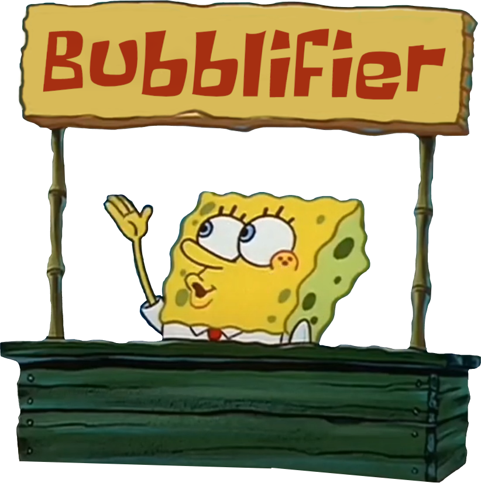
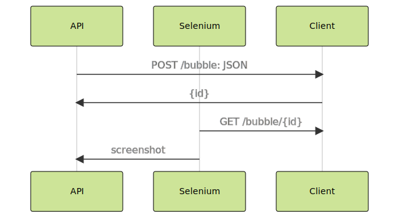

# Bubblifier Bot

    

© 2020 Pool Party Corp. All rights reserved.

[comment]: <> (TODO: use preview from botostore site)

## Usage guide

Add [`@BubblifierBot`](https://t.me/BubblifierBot) to the chat to be able to create custom bubble sticker packs using
following commands:

- `/bubble` - on first invocation it both creates a new sticker pack for the chat
  and adds referenced message bubble sticker, on the following invocations it only adds new bubble stickers to the
  existing pack

## Structure

The project structure consisting of the main three component is as follows:

The communication for request processing:

## Tools and Libraries

### Bubble rendering server ([client/](client/))

- [TypeScript](http://typescriptlang.org/) language

- [React](https://reactjs.org/) - a JavaScript library for building user interfaces

### Telegram bot part ([api/](api/))

- [Rust](https://www.rust-lang.org/) programming language

- [Teloxide](https://github.com/teloxide/teloxide/) - a full-featured framework that empowers you to easily build
  [Telegram bots](https://telegram.org/blog/bot-revolution) using the
  [`async`/`await`](https://rust-lang.github.io/async-book/01_getting_started/01_chapter.html)
  syntax in Rust

- [Diesel](https://github.com/diesel-rs/diesel) - a safe, extensible ORM and Query Builder for Rust

- [Image](https://github.com/image-rs/image) - encoding and decoding images in Rust

- [Thirtyfour](https://github.com/stevepryde/thirtyfour) - [Selenium](https://www.selenium.dev/) WebDriver client
  for Rust
